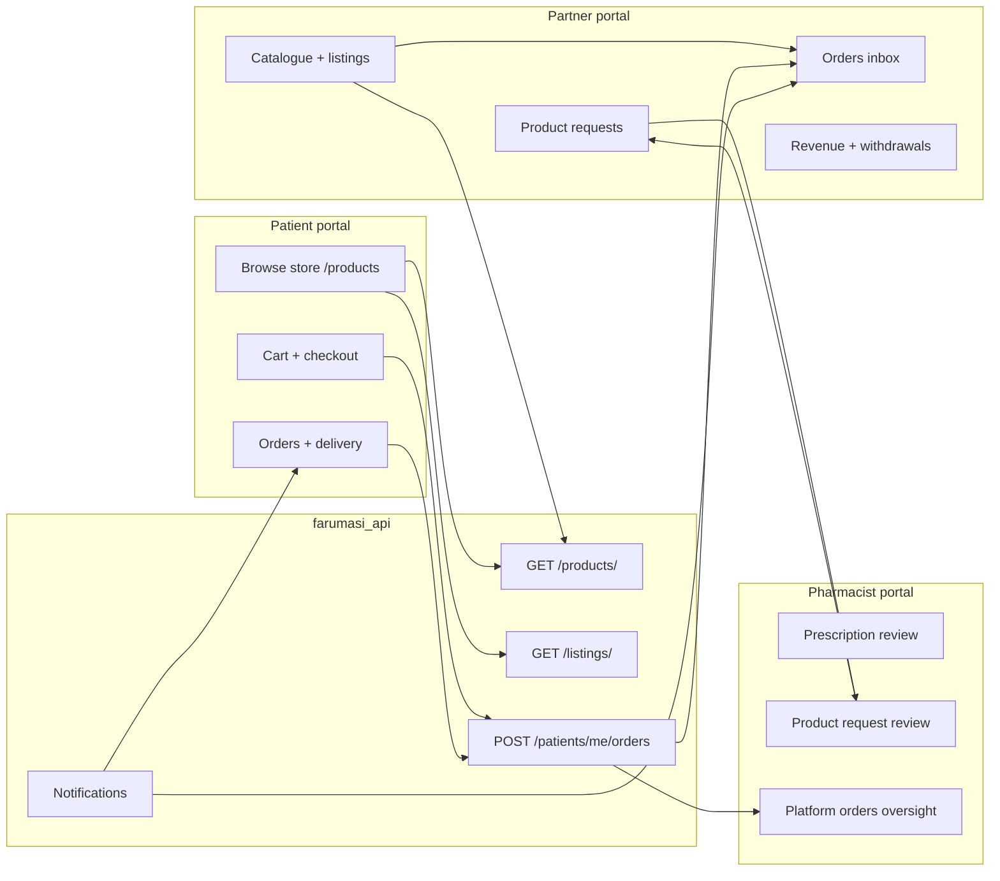

# FARUMASI — Cross-portal audit (Patient · Pharmacist · Partner)

**Date:** June 2026  
**Scope:** How the three portals interact on real backend data, and gaps worth fixing.

---

## 1. End-to-end flows (live API)



### 1.1 Marketplace (products & listings)

| Step | Who | API | Status |
|------|-----|-----|--------|
| Super-admin / pharmacist approves product | Pharmacist / admin | `PATCH /products/{id}/status` | ✅ Backend |
| Partner browses approved catalogue | Partner | `GET /products/?only_with_listings=false` | ✅ Wired |
| Partner creates listing (price, stock) | Partner | `POST /partners/me/listings` | ✅ Wired |
| Patient sees products with listings | Patient | `GET /products/?only_with_listings=true` | ✅ Wired |
| Patient picks seller listing | Patient | `GET /listings/?product_id=` | ✅ Wired |
| Patient checkout | Patient | `POST /patients/me/orders` with `product_listing_id` | ✅ Wired |
| Stock decremented on order | API | `order_service` stock adjust | ✅ Backend |

**Partner portal:** No mock layer (`isMockMode` not used). Product pages load from API; images use `mediaUrl()` for relative `/media/` paths.

### 1.2 Orders

| Step | Who | API | Status |
|------|-----|-----|--------|
| Patient places order | Patient | `POST /patients/me/orders` | ✅ |
| Partner notified | API | `NotificationService.order_placed` → partner owner | ✅ |
| Partner lists / updates status | Partner | `GET /partners/me/orders`, `PATCH .../status` | ✅ |
| Pharmacist sees orders | Pharmacist | Pharmacy-scoped or platform orders endpoints | ⚠ Depends on pharmacy vs partner order |
| Patient tracks order | Patient | `GET /orders/{id}`, deliveries | ✅ |

Pickup orders: partner marks **ready_for_pickup**; delivery leg is pharmacist/rider (partner does not deliver).

### 1.3 Product requests (new SKU)

| Step | Who | API | Status |
|------|-----|-----|--------|
| Partner drafts + submits request | Partner | `POST /product-requests/`, submit | ✅ |
| Pharmacist + super-admin notified | API | `product_service` on submit | ✅ |
| Pharmacist reviews | Pharmacist | `PATCH /product-requests/{id}/review` | ✅ |
| Partner sees status + notes | Partner | `GET /product-requests/` | ✅ |
| Approved product in catalogue | Admin flow | Product created → partner can list | ⚠ Manual catalogue step after approve |

### 1.4 Prescriptions (Rx path)

| Step | Who | Status |
|------|-----|--------|
| Patient uploads Rx | Patient → `POST /patients/me/prescriptions` | ✅ |
| Pharmacist reviews | Pharmacist portal `/requests` | ✅ |
| Recommendation → order | Patient cart / `createFromRecommendation` | ✅ |
| Partner fulfils if listing matches | Same order pipeline | ✅ |

---

## 2. Partner portal — data authenticity

| Area | Source | Notes |
|------|--------|--------|
| Dashboard KPIs / charts | `orders`, `listings`, `revenue` services | Derived from API responses |
| Catalogue | `GET /products/` + `GET /partners/me/listings` | Server search + category params |
| My listings | `GET /partners/me/listings` | Insights (counts, stock value) computed client-side from API rows |
| Orders / revenue / settings | Partner `*/me/*` endpoints | ✅ |
| Product requests | `GET /product-requests/` | ✅ |
| Support ticket form | **Email only** (`mailto:partners@farumasi.rw`) | No fake “submitted” toast; no ticket API yet |
| Topbar search | UI only | Not wired to global search API |

**Removed (404):** inventory, analytics, customers, notifications page, compliance, team, activity — sidebar matches.

---

## 3. Gaps & recommendations

### P0 — Addressed (June 2026)

| # | Gap | Fix |
|---|-----|-----|
| G1 | Partner listings showed as “Partner Wholesale” | `ListingPartnerBrief` on `GET /listings/`; product detail uses real name |
| G2 | Partner profile not on patient store | `GET /partners/public/` + store carousel includes companies with logos |
| G3 | Patient orders mock mode | Still gated by `isMockMode()` — do not set `NEXT_PUBLIC_USE_MOCK` in production |
| G4 | Fake product rating `4.2` | Rating set to `0`; stars hidden when `rating` is falsy |
| G5 | Checkout ignored partner sellers | Cart sends `partner_company_id` when `sellerKind === "partner"` |

### P1 — Operational / UX

| # | Gap | Portals | Recommendation |
|---|-----|---------|----------------|
| G5 | **Catalogue pagination** capped at 100 products per request | Partner | Server pagination UI or “load more” using `offset`/`total` |
| G6 | **Revenue `order_code` on records** | Partner | Restart API after schema change; already in backend |
| G7 | **Partner `GET /partners/me` profile fields** (`logo_url`, `commission_rate_percent`) | Partner | Restart API process after migration |
| G8 | **Support tickets** no REST endpoint | Partner | Add `POST /support/tickets` or integrate Freshdesk later |
| G9 | **Topbar global search** placeholder only | Partner | Search orders/listings via dedicated endpoint or client-side index |
| G10 | **Pharmacist vs partner order queues** — pharmacist portal may not surface partner-company orders clearly | Pharmacist | Confirm `GET /orders/pharmacy/all` or role filter includes partner fulfilment |

### P2 — Nice to have

| # | Gap | Recommendation |
|---|-----|----------------|
| G11 | Patient `price_from` fallback when no listings uses deterministic placeholder | Show “Price on request” instead of fake RWF |
| G12 | Product request approval → auto-add to catalogue notification to partner | Email/notification when SKU goes live |
| G13 | `PORTAL_INTEGRATION_MAP.md` still marks partner as “NO API” | Update doc to ✅ (outdated) |
| G14 | Insurance on partner listings (`accepted_insurance_ids`) | UI on listing edit + patient checkout filter |

---

## 4. Who does what (summary)

| Capability | Patient | Partner | Pharmacist |
|------------|---------|---------|------------|
| Browse approved products | ✅ Store | ✅ Catalogue | ⚠ Own tools |
| Set price/stock | — | ✅ Listings | Pharmacy listings (separate) |
| Place order | ✅ | — | — |
| Fulfil order | — | ✅ Until ready/pickup | ✅ Delivery / Rx |
| Request new product | — | ✅ | ✅ Review |
| Review prescription | — | — | ✅ |
| Withdraw earnings | — | ✅ | — |
| Platform commission | — | Read-only in settings | — |

---

## 5. Verification commands

```bash
cd farumasi_api
python scripts/stress_test_partner.py
python scripts/test_partner_portal_e2e.py
```

Requires API `:8000`, partner portal `:3004`, and seeded `partner_admin@farumasi.com`.

---

## 6. Recent partner product UX changes

- Shared **ProductsToolbar**: search, sort, grid/table toggle, result counts.
- **ProductInsightsStrip**: live counts from API-backed arrays.
- **Catalogue**: debounced server search, category filter via API, listed/Rx filters, table view.
- **My Listings**: stock filters, price/stock sort, table view, inventory value insight, `mediaUrl` images.

All figures (totals, stock counts, prices) are computed from **`/products/`** and **`/partners/me/listings`** responses, not static mock files.
