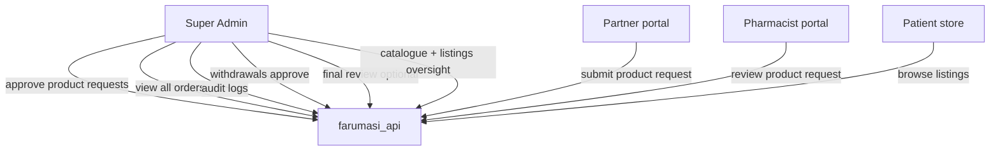

# FARUMASI — Super Admin portal audit (CIP MVP)

**Date:** June 2026  
**Portal:** `farumasi_super_admin` — http://localhost:3005  
**API:** http://localhost:8000/api/v1  
**Credentials:** `admin@farumasi.com` / `Admin@12345`

---

## 1. MVP scope (sidebar)

| Section | Route | Data source | Status |
|---------|-------|-------------|--------|
| Overview | `/dashboard` | `GET /analytics/admin`, `/orders/`, `/product-requests/`, `/listings/` | ✅ Live |
| Platform | `/users` | `GET /users/` | ✅ Live |
| Platform | `/pharmacies` | `GET /pharmacies/` | ✅ Live |
| Platform | `/suppliers` | `GET /partners/` | ✅ Live |
| Marketplace | `/catalogue` | `GET /products/?include_unapproved=true` | ✅ Live |
| Marketplace | `/product-requests` | `GET /product-requests/`, `PATCH .../review` | ✅ Live (actions wired) |
| Marketplace | `/listings` | `GET /listings/` (seller names nested) | ✅ Live |
| Operations | `/orders` | `GET /orders/` | ✅ Live |
| Operations | `/prescriptions` | `GET /prescriptions/` | ✅ Live |
| Finance | `/revenue` | `GET /revenue/`, summary | ✅ Live |
| Finance | `/withdrawals` | `GET /withdrawals/`, approve/reject | ✅ Live |
| Compliance | `/audit` | `GET /audit/` | ✅ Live |
| System | `/settings` | Static UI only | ⚠️ Placeholder |

**Hidden from sidebar (still in repo):** ecosystem, BI, AI, hospitals, doctors, riders, etc. — “Coming Soon” stubs.

**Legacy:** `src/data/mock.ts` is **not imported** by MVP routes.

---

## 2. Cross-portal flows (super admin role)



| Flow | Super admin action | API | Partner / Patient |
|------|-------------------|-----|-------------------|
| New SKU request | Approve/reject on `/product-requests` | `PATCH /product-requests/{id}/review` | Partner submits |
| Catalogue governance | View all products + approval status | `GET /products/` | Patient sees approved only |
| Marketplace health | Listings + low stock on dashboard | `GET /listings/` | Patient store sellers |
| Orders oversight | All orders, status filters | `GET /orders/` | Patient places; partner fulfills |
| Payouts | Withdrawal queue | `GET /withdrawals/`, approve | Partner/pharmacy requests |
| Compliance | Audit trail | `GET /audit/` | All portals write audit events |

---

## 3. Audit findings

### P0 — Blockers
| ID | Issue | Fix |
|----|-------|-----|
| — | None if API + seed running | — |

### P0 — Performance / stability (fixed June 2026)

| ID | Issue | Fix |
|----|-------|-----|
| SA-P0-1 | Sidebar `prefetch` on all MVP links → dev server compiles every route at once, CPU/RAM spike | **Fixed:** `prefetch={false}` on sidebar links |
| SA-P0-2 | Recharts `ResponsiveContainer` resize loop in flex layout → GPU/CPU peg, display may cut out | **Fixed:** `SafeChartContainer` with fixed height + debounced measure |
| SA-P0-3 | Loading shell used infinite `animate-pulse` (continuous repaints) | **Fixed:** static skeleton in `portal-loading-shell.tsx` |
| SA-P0-4 | Zustand persist race before auth gate | **Fixed:** wait for `persist.onFinishHydration` |

### P1 — Should fix
| ID | Issue | Fix |
|----|-------|-----|
| SA-P1-1 | `GET /partners/public/` 404 on stale API process | Restart uvicorn |
| SA-P1-2 | Duplicate active partner named like a pharmacy (e.g. Kigali City Pharmacy) | Run `python scripts/seed.py` (suspends legacy partner row) |
| SA-P1-3 | Product request review used `notes` instead of `review_notes` | **Fixed** in `product-requests.service.ts` |
| SA-P1-4 | Approve/Reject buttons were non-functional | **Fixed** on product-requests page |

### P2 — Nice to have
| ID | Issue |
|----|-------|
| SA-P2-1 | Settings page static — no platform settings API |
| SA-P2-2 | Orders missing `partner_company` name in adapter (pharmacy-only fields) |
| SA-P2-3 | Catalogue: no inline PATCH approve from grid |
| SA-P2-4 | Users “Invite User” button not wired |

---

## 4. Automated audit

```powershell
cd farumasi_api
python scripts/audit_super_admin.py
python scripts/stress_test_super_admin.py
```

Start portal:

```powershell
cd farumasi_super_admin
npm run dev
```

---

## 5. Manual test checklist

- [ ] Login with super admin credentials; non-admin role rejected
- [ ] Dashboard KPIs match `/analytics/admin`
- [ ] Users table loads; search works client-side
- [ ] Pharmacies + Partners tables show seeded rows
- [ ] Catalogue shows approved + pending products
- [ ] Product request: Approve/Reject updates status after refresh
- [ ] Listings show **seller name** (not UUID prefix)
- [ ] Orders: partner statuses (`ready_for_pickup`, `out_for_delivery`) display correctly
- [ ] Withdrawals: approve/reject when seed has pending rows
- [ ] Audit log loads recent actions

---

## 6. Related docs

- [CROSS_PORTAL_AUDIT.md](./CROSS_PORTAL_AUDIT.md) — Patient · Pharmacist · Partner
- [farumasi_api/README.md](../farumasi_api/README.md) — seeded accounts
